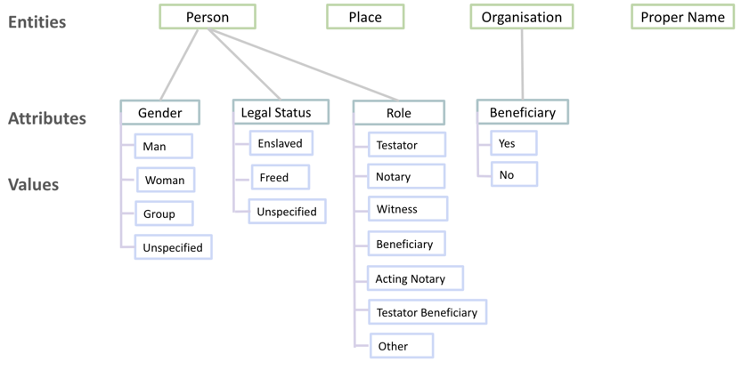

# Annotation Typology

To 'unsilence' colonial archives by broadening access, more inclusive finding aids are required, encompassing all persons mentioned in the archive with emphasis on marginalized ones. Existing generic typologies for named entity recognition and classification tasks mainly focus on the high-level 'universal' or 'ubiquitous' triad *Person*, *Organization* and *Location*. **Our custom typology extends the
universal triad to encompass all mentions of entities, both named and unnamed, and further qualifies them by gender, legal status, notarial roles and other relevant attributes**. Our typology is visually illustrated below:

Our custom typology separates the name of an entity (always tagged separately as Proper Name) from a generic reference to an entity type (Person, Place or Organization). We introduce this distinction primarily because marginalized persons are frequently mentioned in the VOC testaments, and in colonial archives more generally, without name. Instead they are referred to by a variety of terms such as “slaaf” [slave], “leiffeigenen” [serf] and “inlandse burger” [formerly enslaved persons or descendants of freed slaves]. 

## Person

The entity type Person may refer to individuals or groups of people. When annotating a text span as a person, the span should include the proper name and/or available contextual trigger words. Trigger words in this typology also include words or phrases which provide information on the gender, legal status or notarial role of the person(s). Accordingly, the entity type person has three attributes: *Gender*, *Role* and *Legal Status*. When a person is mentioned multiple times across a testament (with or without trigger words), they are annotated with the same attribute which was inferred from the presence of the trigger words.

### Gender 
When the mention of a person is followed or preceded by trigger words which reveal their gender, the text is annotated as a Person with the appropriate value of the attribute *Gender*. For each entity person, the attribute gender takes exactly one of the values from the legend in figure below:

When a person is mentioned without a gender trigger word, their gender is marked as *Unspecified*. This approach restricts possible ‘annotator bias’ due to unfounded inferences.

<!---->

Persons are annotated by trigger words alone, in the absence of a proper name and in the case marginalised persons such as enslaved and formerly enslaved persons. This is because such persons are often mentioned without name and are of particular interest to our research. An example of a mention of an enslaved man without name is given in figure below:

### Legal Status

For each entity *Person*, the attribute Legal Status takes exactly one of the values explained using the legend in the figure below:

The attribute legal status takes the value Enslaved when the trigger words clearly identify the individual(s) to be enslaved. The attribute value *Free(d)* is often triggered by the word ‘vrije’ [free]. It refers to persons who were set free (for different reasons such as when they bought themselves free, as an act of benevolence, or for economic reasons) sometimes on the condition that they adopted the Christian religion. It could also refer to children of the manumitted slaves who, although born free, kept carrying the adjective ‘vrije’ [free], or if they were Christian they were labelled as ‘free Christian’. Finally, the adjective ‘free’ was also used for groups of free indigenous (who were never enslaved) labelled for instance as ‘vrije inlander’ [free native]. The attribute value *Free(d)* captures these three different senses of the word ‘vrije’, for which there is no clear way to clearly disambiguate among. When no trigger words are used, legal status is instead annotated as *Unspecified*.

### Role

The attribute *Role* refers to roles specific to testaments in notarial archives, which may take exactly one of the following values:
* Notary
* Acting Notary
* Testator
* Beneficiary
* Testator Beneficiary
* Witness
* Other

An *Acting Notary* is a role taken on by a person who, in the absence of an officially recognized notary, performs the notarial deed as can be inferred from the extract in figure below (labelled in purple). The role *Testator Beneficiary*, instead, is attributed to those people who are both testator and beneficiary in the context of the testament. For instance, when man and wife collectively write down their testaments, each of them is a testator and often both of them are also each-other’s beneficiaries. The role *Other* is attributed to those persons whose role does not correspond to any of the six roles (for instance the annotation in orange in figure below) or when their role is not clearly mentioned.

## Place 

The entity *Place* is used to annotate places or locations.

## Organization

This entity, as the name suggests, refers to organizations such as companies, orphanages, religious institutions and other branches of the church. Organizations have the attribute *Beneficiary* which can take the value *Yes* or *No* depending on whether the testator decides an organization to be their beneficiary. 

## Proper Name 

The entity *Proper Name* refers to names (proper nouns) of the other entities in this typology: *Person*, *Place* and *Organization*. In the figure below proper names are annotated in pink, which can be compared with Figure 4 and Figure 9 where the same excerpt is labeled using the entity person
and attributes gender and legal status respectively. In our dataset, annotations overlap.

<figure>
  
  <figcaption>
  <strong>Figure 1: </strong>Instance of Annotations of proper names
  </figcaption>
</figure>
